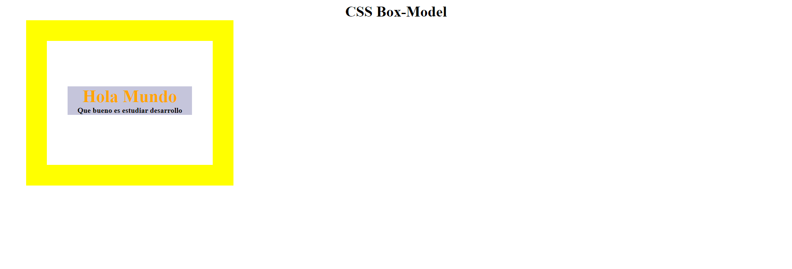
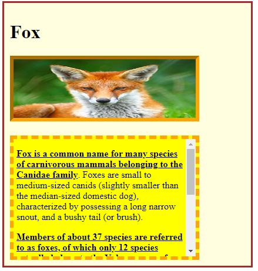

# Ejercicios extra Box Model

En la generación de estilos hay infinitas maneras de llegar a un mismo resultado, así es que el punto de estas tareas es que pongas en práctica el conocimiento y generes estructuras utilizadas frecuentemente en páginas web de producción, no es necesario tener la respuesta 100% igual a la propuesta. Los ejercicios cuentan con solución la cual se recomienda ver solo si te atascas o si ya terminaste el ejercicio.

1. Dada la siguiente imagen, haciendo uso de Box Model intenta replicarla con base en la estructura HTML dada en el archivo cuartaTarea.html. 
   - 

2. Dada la siguiente imagen y el html segundaTarea.html, haciendo uso del box model y selectors llega a una solución lo más parecida posible a la imagen presentada. 
Es importante tener en cuenta que el contenedor con el texto "Fox is a common name for ..." debe tener un alto fijo `heigth: 200px;` y una barra de scroll. Para ello investiga la propiedad overflow y descubrirás como hacer la barra de scroll

   - 

