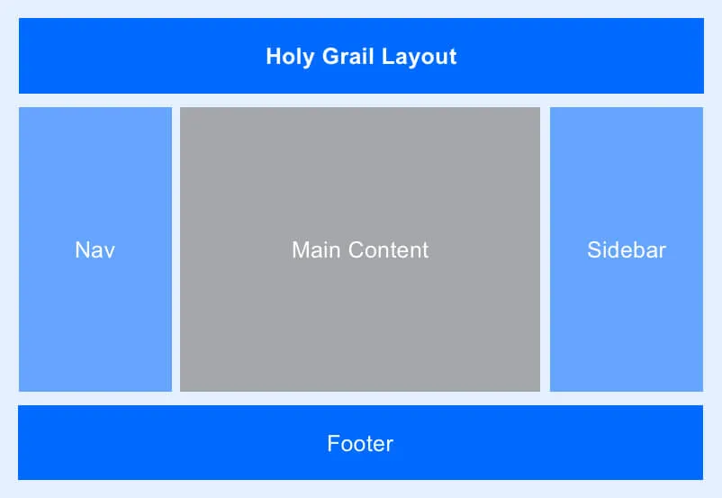
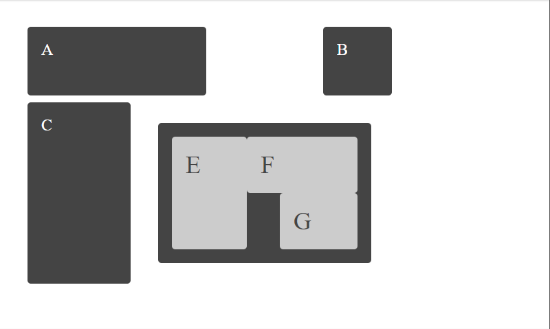

# Tareas del modulo

Las tareas de los módulos son pensadas para profundizar en los temas expuestos e interiorizar más el conocimiento.

## Tareas

Aplica los estilos dados según las condiciones especificadas de manera de llegar a la imagen ejemplo, recuerda que en cuanto a estilos hay infinitas maneras de llegar a la misma solución:

1. Dado el HTML de la primera tarea aplica los estilos css grid para convertirlo en la siguiente imagen. - 

2. Dado el HTML segundaTarea.html haciendo uso de las herramientas aprendidas de CSS grid, llega a la siguiente imagen

   - 

3. Usando CSS grid áreas desarrolla la siguiente layout

   - 

4. Tarea final de Grid, utilizando CSS grid desarrolla la siguiente layout

   - 

## Trabajar en grupos:

- Freider Leandro - Maicol Amaya - Study Room 1
- Juan Cubillos - Study Room 2
- Elizabeth Perez - Gullermo Martinez - Alejandra Taba - Study Room 3
- Jhonathan Suarez - Jhon Velasco - Claudia Lorena  - Study Room 4
- Estiven Valencia - Study Room 7
- Edison Suarez - Study Room 8
- Robin Villamizar - Study Room 9

