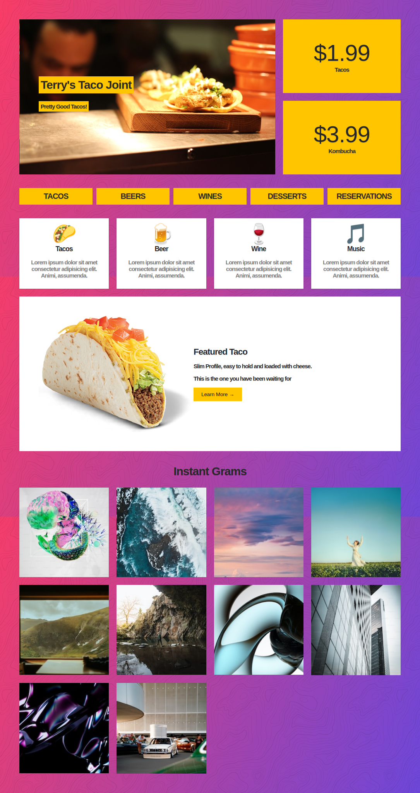

## Grid View VS flexbox

En esta clase veremos un ejercicio practico para ver en que situaciones debemos usar flexbox y cuales es mejor usar grid view.

Para ello replicaremos la siguiente página web 
    

Como ejercicio práctico porponemos crear el siguiente layout usando grid view:
    

Todo el contenido interno de el layout y de cáda área se hará con Flex.

# Importante

- Para lograr el mismo background vamos a usar el siguiente gradiente en el body `background-image: linear-gradient(110deg, #f93d66, #6d47d9);`

- Toda la página tiene un tipo de fuente `font-family: -apple-system, BlinkMacSystemFont, "Segoe UI", Roboto, Helvetica, Arial, sans-serif, "Apple Color Emoji", "Segoe UI Emoji", "Segoe UI Symbol"`

- El color amarillo de las es `#ffc600`

- Los iconos los puedes insertar como emojis en tu HTML, a continuación encontrarás algunos que te serán muy útiles
    - 🌮
    - 🍺
    - 🍷
    - 🎵

- Para dar tamaño a estos emjis usa la propiedad `font-size: 50px`

- Las imágenes y recursos necesarios para realizar este ejercicio están disponibles en la carpeta "resources"