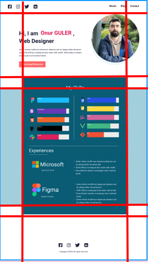
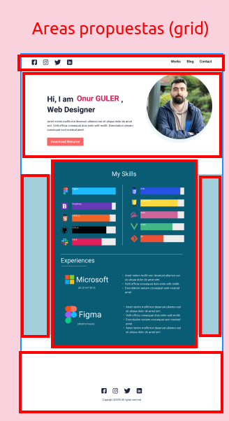

# Proyecto final HTML y CSS

El portafolio de un desarrollador es un instrumento que permite mostrar tu experiencia, las habilidades que tienes, así como tus conocimientos de una forma gráfica, directa. Además, te ayudará a destacar en el mercado laboral y también te permitirá reforzar los conocimientos adquiridos mediante la realización de proyectos.

Es por ésta razón que como proyecto final del módulo de HTML y CSS vas a crear tu portafolio.

En el siguiente enlace de figma ( [enlace al diseño propuesto del portafolio](https://www.figma.com/file/Y3K4Ebh7ARCfw1ewHEFqMz/Portfolio-UI---Web-%26-Mobile-(Community)?type=design&node-id=286-117&mode=design&t=nydqAaHNSmKK63J0-0) ) vas a encontrar un diseño de un protafolio web en versión de escritorio y mobile. Tendrás que replicar con exactitud en ambas versiones utilizando el mismo tipo de fuente, tamaños de fuente, colores e imágenes.

## Criterios de aceptación

   1. El desarollo debe ser lo más fiel posible al diseño, utiliza los mismo colores, tipos de fuente, tamaños de fuente.
   2. Debe ser responsive, en el diseño de figma encontrarás el diseño en version de escritorio y celulares (tu desarollo debe verse exactamente lo más parecido posible diseño), para tamaños de pantalla intermedios como tabletas deberás utilizar el mismo diseño mobile, puedes usar 1080px como breakpoint para el diseño mobile (max-width: 1080px)
   3. Limita al máximo el uso de `media queries`, piensa en contenedores hechos con `flexbox` y `flex-wrap` que se ajusten autmáticamente.
   4.  Utilizar `grid view` para definir el layout de tu página y `flexbox` para crear el contenido dentro de cada sección o área del layout
   5. Te recomendamos pensar en un grid con 3 columnas por 6 filas como lo muestra la imágen. El contenido interno de cada área lo puedes ubicar usando flexbox
   
   
   

## IMPORTANTE

En figma puedes encontar propiedades como `font-size`, `color`, `font-weight`, `line-height` entre otras,  que te serán muy útiles. Pero tambien vas a encontar propiedades relacionadas con  `width` que te van a  causar muchos problemas, esto pasa por que el diseño de figma esta pensado para un tamaño especifico de pantalla en desktop (1152px), por lo tanto desde el principio **NO uses los atributos `width` que figma te propone** porque vas a tener problemas para hacer que tu página se vea bien en todos los tamaños de pantalla.

En su lugar de usar anchos de columna fijos piensa en porcentajes o columnas de grid que midan fracciones del espacio disponible ejemplo 0.3fr, 0.5fr o 1fr o automáticos `auto` y en contenedores flexibles con `flex-wrap`. 

Recuerda que `auto` a diferencia de `fr` toma un tamañano automático que se agrandará más o menos dependiendo de el contenido del área, te será muy útil para definir el alto de las filas de tu grid layout, puedes usarlo por ejemplo para definir el alto de la filas que contienen la secciones de "Perfil" y "My Skills", las demás filas si pueden tener un alto fijo en pixeles.

## Recursos necesarios para el desarrollo

1. Todas las imagenes que necesitas para el protafolio las puedes encontrar en la carpeta `resources`
2. El tipo de fuente que debes usar es "Heebo", para ello incluye en la etiqueta body la propiedad `font-family: 'Heebo';`. Heebo es una fuente que no esta disponible para todos los navegadores, por lo tanto debes importarla de `https://fonts.googleapis.com/css?family=Heebo` así:
```html
   <head>
      <title> Portfolio </title>
      <link href="https://fonts.googleapis.com/css?family=Heebo" rel="stylesheet"/>
      <!-- Despues de importar la fuente si puedes incluir tus hojas de estilos -->
      <link href="<TU_HOJA_DE_ESTILOS_CSS>" rel="stylesheet">
   </head>
```
3. Los colores de fuente del titulo son `#21243D` y `#E01E5A`;
4. El color de fuente de la sección "My Skills" es `#EDF7FA`;
5. Recuerda que puedes encontrar los tamaños de fuente (font-size) y propiedades como font-weight y line-height en el diseño de Figma.


