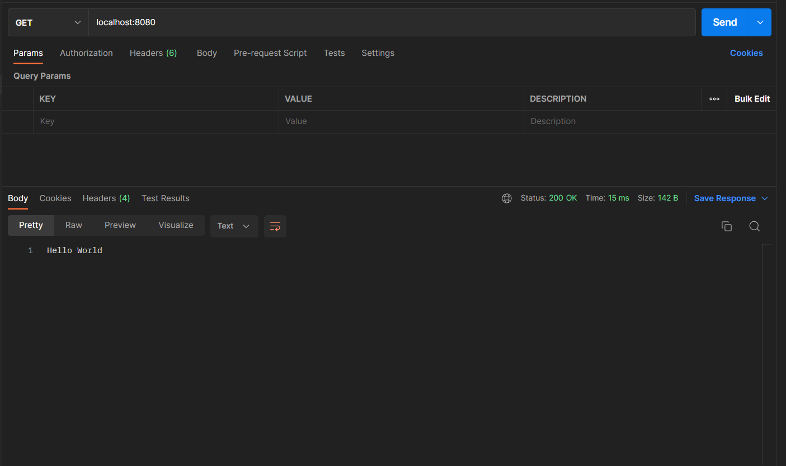
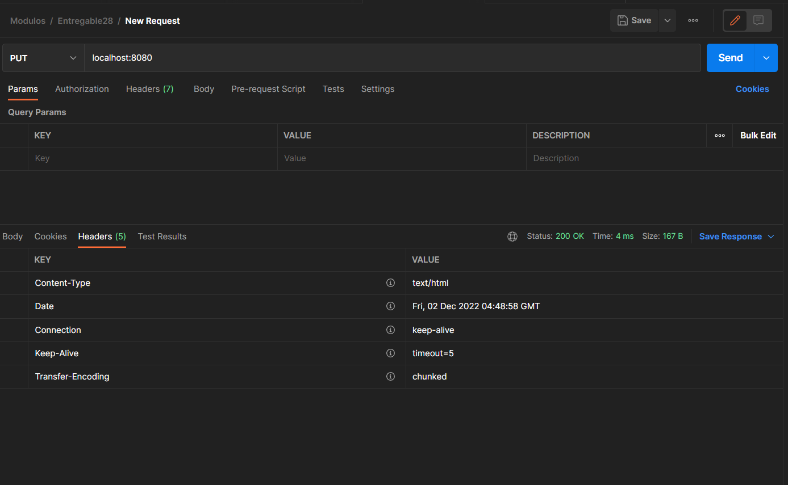

# NodeJS III

En este el tercer y ultimo módulo de NodeJS fundamental, miraremos otra de las herramientas cruciales en el manejo de NodeJS y en el entendimiento de sus adiciones a Javascript que lo hacen una de las tecnologías Backend mas interesantes del mercado, el módulo `build-in` HTTP el cual nos permitirá montar servicios HTTP en nuestros sistemas el cual nos dará puertas a la construcción de APIs Restful

## HTTP

NodeJS cuenta con un módulo `build-in` para la construcción de servidores http llamado `HTTP`, su implementación en nuestro modulos se hace igual que para la que ya vimos llamada `fs`, simplemente utilizando la palabra clave correspondiente según nuestro proyecto o sea `import` o `require` e importaremos `http`, de la siguiente manera.

```js
//Para require
var http = require("http");
//Para import
import http from "http";
```

Luego, este nos permite utilizando el metodo `createServer()` junto con un callback para escuchar por un puerto. Miremos un ejemplo.

```js
import http from "http";

http
  .createServer((req, res) => {
    res.write("Hello World");
    res.end();
  })
  .listen(8080);
```

Al ejecutar este script nuestra consola lucirá congelada, pero en realidad lo que está sucediendo es que nuestro servidor web está ejecutandose y escuchando en el puerto 8080 que le indicamos, entonces usando Postman hacemos un request a `localhost:8080` y esto es lo que obtenemos.

'

Como vemos en la respuesta obtenemos el texto indicado, "Hello World".

En este caso la petición utilizada es GET pero en realidad con cualquier tipo de petición se nos generará esta respuesta pues por ahora no hemos definido rutas en nuestro servidor sino que simplemente indicamos que al alguien intentar acceso a la ruta responderá eso.

### Agregando Headers a las respuestas

Podemos agregar headers a las respuestas del servidor utilizando el objeto `res`. Miremos un ejemplo.

```js
import http from "http";

//Creamos un servidor http y lo ponemos a escuchar por el puerto 8080
http
  .createServer((req, res) => {
    res.writeHead(200, { "Content-Type": "text/html" });
    res.write("Hello World");
    res.end();
  })
  .listen(8080);
```

Entonces al acceder a los headers de la respuesta vemos el header presente.



### Obtener el string del query

Con el objeto `req` podremos acceder a toda la información del request, de esta manera podemos leer por ejemplo argumentos de la petición, miremos por ejemplo como sabe el URL de la petición.

```js
import http from "http";

//Creamos un servidor http y lo ponemos a escuchar por el puerto 8080
http
  .createServer((req, res) => {
    console.log(req.url);
    res.write("Hello World");
    res.end();
  })
  .listen(8080);
```

Entonces al ejecutar un request a la ruta `localhost:8080/testURL` en nuestra consola se imprimirá `/testURL`.

Estas son las funcionalidades basicas de `http`, en breve resumiremos con sus utilidades pero primero miremos un concepto clave en el desarrollo Backend y aclaremoslo.

## API Restful.

A medida que los avances tecnologicos se hacen mas y mas parte de nuestro día a día casi todos apuntan a la misma evolución y es la integración de estos avances con fuentes de información para facilitarnos la vida, esta fuente de información practicamente siempre es `Internet`, entonces sería muy util si todos los dispositivos tuvieran un formato estandar para su comunicación en Internet, porque todo sería abstraido a la configuración de ese formato. Pues es así, miremos como funciona un API Restful.

Por sus siglas en ingles Application Programming Interface se refiere como su nombre lo dice a una interfaz de comunicación que permite utilizar un servicio mediante otro, una analogía interesante son los conectores de electricidad de nuestro hogar y oficina, estos son un API que nos permite el acceso a electricidad independiente del equipo que se conecte al conector.

Restful API es el sucesor de metodos anteriores como SOAP y WSDL cuya implementación y uso es mas compleja pues se requiere de mas recursos.

### Como funciona?

Es un estandar de comunicación bidireccional, es decir, tanto el Cliente como el API tiene la posibilidad de enviar información al otro, el cliente hacia el API mediante el `request` y el servidor al cliente mediante el `Request`.

Este trabaja sobre el protocolo HTTP para esta comunicación y sus estandares, estandares que ya hemos visto y repasado bastante en modulos anteriores.

La arquitectura `REST` por sus siglas Representational State Transfer utiliza los metodos HTTP para su comunicación y maneja como formato de elemento de comunicación por lo general el JSON pero también puede trabajar con estructuras XML o cualquier otra de intercambio, pero por lo general se utiliza solamente JSON.

De su decoración `Restful` viene otro comportamiento fundamental en el entendimiendo de este metodo de comunicación y sus ventajas y es que este es un protocolo `stateless`, esto indica que la comunicación en los API Restful es sin estado, es decir, que en cada petición nueva debe enviarse TODA la información necesaria para el procesado, como headers de autenticación, payload para el procesado, etc.

## Construyendo un API Restful con HTTP

Ahora que entendemos por completo este tipo de comunicaciones miremos como se implementaría un API Restful en NodeJS con su modulo http.

Ya sabemos como obtener la ruta de una petición, en base a eso podemos manejar nuestras respuestas, miremos para empezar como montamos nuestro servidor.

```js
import http from "http";

const port = 3000;

const server = http.createServer((req, res) => {
  res.writeHead(200, { "Content-Type": "text/html" });
  console.log(req.url);
  res.write("Hello World");
  res.end();
});

server.listen(port, () => {
  console.log(`Server Listening at Port ${port}`);
});
```

Así entonces al ejecutar este script nuestro servidor estará funcionando en el puerto 3000, luego obteniendo el parametro `req.url` podemos saber la ruta de la petición, hagamos entonces un switch para manejarla según lo deseado.

```js
import http from "http";

const port = 3000;

const books = JSON.stringify([
  { title: "The Alchemist", author: "Paulo Coelho", year: 1988 },
  { title: "The Prophet", author: "Kahlil Gibran", year: 1923 },
]);

const authors = JSON.stringify([
  { name: "Paulo Coelho", countryOfBirth: "Brazil", yearOfBirth: 1947 },
  { name: "Kahlil Gibran", countryOfBirth: "Lebanon", yearOfBirth: 1883 },
]);
//Creamos el servidor
const server = http.createServer((req, res) => {
  res.writeHead(200, { "Content-Type": "text/html" });
  switch (req.url) {
    case "/books":
      res.writeHead(200);
      res.end(books);
      break;
    case "/authors":
      res.writeHead(200);
      res.end(authors);
      break;

    default: //Comportamiento por defecto cuando no encuentra la ruta
      res.writeHead(404);
      res.end(JSON.stringify({ error: "Route not found" }));
  }
});

//Montamos el servidor en el puerto indicado
server.listen(port, () => {
  console.log(`Server Listening at Port ${port}`);
});
```

De esta manera ya le generamos un comportamiento por defecto para cuando no se encuentra la ruta, pero si le enviamos /authors nos devolverá el arreglo con los autores y si le enviamos por ejemplo la ruta /users que no está definida responderá error 404.

De esta manera podemos crear APIs Restful con el módulo HTTP

## Final del módulo

Llegamos al final de los módulos introductorios de NodeJS, ahora si pasaremos a mirar una herramienta robusta para la construcción de servicios HTTP que son la base del Backend y de las APIs que son el lenguaje común de hoy día, todos los dispositivos y sistemas se comunican bajo estos estandares.
